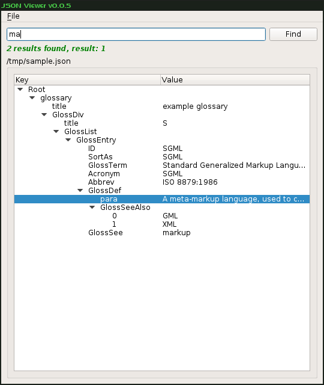

# JSON Viewer



Python3 script to view a JSON file as a tree in GUI.

Fork of [ashwin/json-viewer](https://github.com/ashwin/json-viewer) with
some enhancements and cherry-picks from
[arfan/json-viewer](https://github.com/arfan/json-viewer/) and
[zhangxiao/json-viewer-windows](https://github.com/zhangxiao/json-viewer-windows/) .

Invoke as:
```
$ ./json_viewer.py sample.json
```

Or, to read json from stdin:
```
$ cat sample.json|./json_viewer.py -
```
