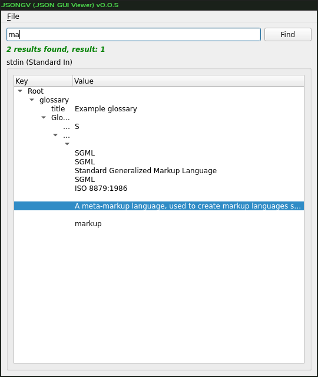

# JSON GUI Viewer (JSONGV)  #



Simple GUI to view JSON in a tree. Written in python3.

## Usage ##

Can be invoked with the file as a command line parameter:
```bash
./jsongv.py sample.json
```

Or, JSON data can be read in from stdin:
```bash
cat sample.json|./jsongv.py -

./jsongv.py - <sample.json
```

Consecutive clicks on the "Find" button will find the next result.

## Key and Mouse Mapping ##

You can _double-click_ on any field to do a find on that field's content. If
the field is a parent, you need to also hold `SHIFT` as _double-click_ is used
to expand that parent.

## History ##

Originally a fork of
[ashwin/json-viewer](https://github.com/ashwin/json-viewer) with
some cherry-picks from
[arfan/json-viewer](https://github.com/arfan/json-viewer/) and
[zhangxiao/json-viewer-windows](https://github.com/zhangxiao/json-viewer-windows/) .
